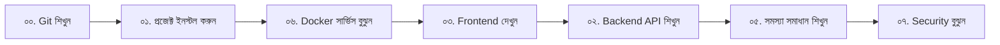

# 📚 AmanaMart - সম্পূর্ণ ডকুমেন্টেশন সূচিপত্র

> **সম্পূর্ণ প্রজেক্টের বিষয়বস্তুর সুসংগঠিত তালিকা** | সব কিছু এক নজরে

🌐 **GitHub Repository**: [https://github.com/mahmudulhassan-dev/amanamart-ecommerce](https://github.com/mahmudulhassan-dev/amanamart-ecommerce)

---

## 🎯 এই ডকুমেন্টেশন কীভাবে ব্যবহার করবেন?

এই সূচিপত্র আপনাকে **সম্পূর্ণ প্রজেক্টের প্রতিটি অংশ** সম্পর্কে জানতে সাহায্য করবে। প্রতিটি ক্যাটাগরিতে ক্লিক করে বিস্তারিত জানুন।

---

## 📖 ক্যাটাগরি সমূহ (Categories)

### [০০. 🌿 Git ইন্টিগ্রেশন গাইড](#০০--git-ইন্টিগ্রেশন-গাইড)

### [০১. 🚀 শুরু করার গাইড](#০১--শুরু-করার-গাইড-installation)

### [০২. ☕ ব্যাকএন্ড আর্কিটেকচার](#০২--ব্যাকএন্ড-আর্কিটেকচার-backend)

### [০৩. ⚛️ ফ্রন্টএন্ড ডিজাইন](#০৩--ফ্রন্টএন্ড-ডিজাইন-frontend)

### [০৪. 📊 ড্যাশবোর্ড](#০৪--ড্যাশবোর্ড-dashboard)

### [০৫. 🛠️ সমস্যা সমাধান](#০৫--সমস্যা-সমাধান-troubleshooting)

### [০৬. 🐳 ডকার এবং সার্ভিস](#০৬--ডকার-এবং-সার্ভিস-docker)

### [০৭. 🔐 কনফিগারেশন এবং সিক্রেটস](#০৭--কনফিগারেশন-এবং-সিক্রেটস-security)

---

## ০০. 🌿 Git ইন্টিগ্রেশন গাইড

> **যারা Git সম্পর্কে কিছুই জানেন না, তাদের জন্য একদম শুরু থেকে শেষ পর্যন্ত গাইড**

### 📄 [সম্পূর্ণ Git টিউটোরিয়াল](00_Git_Integration/README.md)

**এই সেকশনে আছে**:
- ✅ Git কী এবং কেন দরকার?
- ✅ Windows এ Git ইনস্টলেশন (ধাপে ধাপে ছবি সহ)
- ✅ প্রথমবার সেটআপ (নাম, ইমেইল কনফিগারেশন)
- ✅ আপনার প্রজেক্টে Git শুরু করা
- ✅ GitHub এ Repository তৈরি এবং আপলোড
- ✅ দৈনিক কাজের কমান্ড (চিট শীট)
- ✅ সমস্যা সমাধান
- ✅ Personal Access Token তৈরি

**কাদের জন্য?** 🎓
- যারা প্রথমবার Git ব্যবহার করছেন
- যারা GitHub এ কোড আপলোড করতে চান
- যারা টিমে কাজ করতে শিখতে চান

---

## ০১. 🚀 শুরু করার গাইড (Installation)

> **প্রজেক্ট ইনস্টল এবং রান করার সম্পূর্ণ নির্দেশিকা**

### 📄 [ইনস্টলেশন গাইড](01_Setup/README.md)

**এই সেকশনে আছে**:
- কীভাবে Docker ইনস্টল করবেন?
- প্রজেক্ট ক্লোন/ডাউনলোড করা
- সব সার্ভিস রান করা (`docker-compose up`)
- প্রথমবার চালু করার পর যাচাই

**সিস্টেম রিকোয়ারমেন্ট**:
```
- Docker Desktop (Windows/Mac) or Docker Engine (Linux)
- RAM: কমপক্ষে 4GB
- Storage: কমপক্ষে 5GB ফ্রি স্পেস
```

---

## ০২. ☕ ব্যাকএন্ড আর্কিটেকচার (Backend)

> **Java Spring Boot REST API - সম্পূর্ণ ব্যাকএন্ড লজিক**

### 📄 [ব্যাকএন্ড ডকুমেন্টেশন](02_Backend_API/README.md)

**এই সেকশনে আছে**:
- API Endpoints তালিকা
- Database Schema এবং Models
- Business Logic ব্যাখ্যা
- Spring Boot Configuration
- Redis Caching কৌশল

**টেকনোলজি স্ট্যাক**:
| টেকনোলজি | ভার্সন | কাজ |
|-----------|--------|------|
| Java | 21 (LTS) | প্রোগ্রামিং ভাষা |
| Spring Boot | 3.4.1 | ফ্রেমওয়ার্ক |
| PostgreSQL | 16 | ডাটাবেস |
| Redis | 7 | Caching |

**API উদাহরণ**:
```
GET  /api/products          → সব পণ্য
GET  /api/products/{id}     → একটি নির্দিষ্ট পণ্য
POST /api/products          → নতুন পণ্য যোগ
```

---

## ০৩. ⚛️ ফ্রন্টএন্ড ডিজাইন (Frontend)

> **React.js + Vite - আধুনিক এবং দ্রুতগতির UI**

### 📄 [ফ্রন্টএন্ড ডকুমেন্টেশন](03_Frontend_React/README.md)

**এই সেকশনে আছে**:
- Component Structure
- Routing Setup (React Router)
- State Management
- API Integration
- Tailwind CSS Theming

**প্রধান Components**:
```
📁 src/
├── 📁 components/
│   ├── Navbar.jsx          (নেভিগেশন বার)
│   ├── ProductCard.jsx     (পণ্যের কার্ড)
│   ├── Footer.jsx          (পাদটিকা)
│   └── HeroSection.jsx     (মূল ব্যানার)
├── 📁 pages/
│   ├── Home.jsx            (হোম পেজ)
│   ├── ProductList.jsx     (পণ্য তালিকা)
│   └── ProductDetail.jsx   (বিস্তারিত পণ্য)
└── 📁 services/
    └── api.js              (ব্যাকএন্ড কানেকশন)
```

**ডিজাইন ফিচার**:
- ✨ Glassmorphism Effect
- 🌈 Gradient Backgrounds
- 💫 Smooth Animations
- 📱 Fully Responsive

---

## ০৪. 📊 ড্যাশবোর্ড (Dashboard)

> **এডমিন প্যানেল এবং পরিসংখ্যান**

### 📄 [ড্যাশবোর্ড ডকুমেন্টেশন](04_Dashboard/README.md)

**এই সেকশনে আছে**:
- এডমিন লগইন
- পণ্য ম্যানেজমেন্ট (যোগ/সম্পাদনা/মুছে ফেলা)
- অর্ডার ট্র্যাকিং
- ব্যবহারকারী ম্যানেজমেন্ট
- বিক্রয় রিপোর্ট

---

## ০৫. 🛠️ সমস্যা সমাধান (Troubleshooting)

> **সাধারণ সমস্যা এবং তাদের সমাধান**

### 📄 [ট্রাবলশুটিং গাইড](05_Troubleshooting/README.md)

**এই সেকশনে আছে**:

### 🔴 Docker সংক্রান্ত সমস্যা
- কন্টেইনার চালু হচ্ছে না
- Port already in use
- Volume mount ইস্যু

### 🔴 Database সংক্রান্ত সমস্যা
- Connection refused
- Authentication failed
- Data loss সমস্যা

### 🔴 Frontend/Backend সমস্যা
- API কানেকশন ব্যর্থ
- CORS error
- Build failure

---

## ০৬. 🐳 ডকার এবং সার্ভিস (Docker)

> **প্রতিটি Docker Service এর বিস্তারিত ব্যাখ্যা**

### 🔴 [Redis Service](06_Docker/01_Redis_Service.md)

**কাজ**: Caching এবং Session Management

**বিস্তারিত**:
- ⚡ সুপারফাস্ট ইন-মেমোরি ডাটা স্টোর
- 🔥 পার্ফরমেন্স অপটিমাইজেশন
- 📊 ব্যবহারের পরিসংখ্যান
- 🔧 Configuration Options

**কেন দরকার?**
যখন একজন ইউজার কোনো প্রোডাক্ট সার্চ করে:
1. প্রথমবার → ডাটাবেস থেকে আসে (ধীর)
2. দ্বিতীয়বার → Redis থেকে আসে (দ্রুত ⚡)

---

### 🐘 [PostgreSQL Service](06_Docker/02_PostgreSQL_Service.md)

**কাজ**: Primary Data Storage (মূল ডাটাবেস)

**বিস্তারিত**:
- 💪 সবচেয়ে শক্তিশালী Open Source Database
- 🔒 ACID Compliant (ডাটা কখনো হারায় না)
- 📈 লাখ লাখ ট্রানজেকশন সামলাতে পারে
- 🌍 Apple, Instagram এর পছন্দ

**Configuration**:
```yaml
Database: amanamart
User: postgres
Password: root
Port: 5432
```

---

### ☕ [Backend Service](06_Docker/03_Backend_Service.md)

**কাজ**: Business Logic এবং API

**বিস্তারিত**:
- 🧠 সব বিজনেস লজিক এখানে
- 🔗 ডাটাবেস এবং Redis এর মধ্যে সংযোগ
- 🔐 Authentication এবং Authorization
- 📝 Data Validation

**Technology**:
- Java 21 (Latest LTS)
- Spring Boot 3.4.1
- Maven Build System

---

### ⚛️ [Frontend Service](06_Docker/04_Frontend_Service.md)

**কাজ**: User Interface (যা ইউজার দেখে)

**বিস্তারিত**:
- 🎨 সুন্দর এবং আধুনিক ডিজাইন
- ⚡ দ্রুত লোডিং (Vite দিয়ে তৈরি)
- 📱 সব ডিভাইসে চলে (Mobile, Tablet, Desktop)
- 🌈 প্রিমিয়াম UI/UX

**Technology**:
- React 18
- Vite 5
- Tailwind CSS

---

## ০৭. 🔐 কনফিগারেশন এবং সিক্রেটস (Security)

> **⚠️ অত্যন্ত গোপনীয় তথ্য - সাবধানে ব্যবহার করুন**

### 📄 [সিক্রেটস ভল্ট](07_Configuration_Secrets/README.md)

**এই সেকশনে আছে**:
- সব পাসওয়ার্ড এবং API Keys
- Database Credentials
- JWT Secret Keys
- Third-party API Tokens

**⚠️ সতর্কতা**:
- এই ফাইল কখনো GitHub এ push করবেন না
- `.gitignore` এ অন্তর্ভুক্ত আছে কিনা নিশ্চিত করুন
- Production এ অবশ্যই পাসওয়ার্ড পরিবর্তন করুন

---

## 📊 প্রজেক্ট স্ট্যাটিস্টিকস

```
📁 Total Files: 150+
📝 Lines of Code: 5000+
🐳 Docker Services: 4
📚 Documentation Pages: 10+
⏱️ Development Time: 2 Weeks
```

---

## 🗺️ প্রজেক্ট স্ট্রাকচার (ফোল্ডার সংগঠন)

```
devamanamart-ecommerce/
│
├── 📁 backend/                  ← Java Spring Boot
│   ├── src/main/java/
│   ├── src/main/resources/
│   └── pom.xml
│
├── 📁 frontend/                 ← React + Vite
│   ├── src/
│   ├── public/
│   └── package.json
│
├── 📁 docs/                     ← সব ডকুমেন্টেশন
│   ├── 00_Git_Integration/
│   ├── 01_Setup/
│   ├── 02_Backend_API/
│   ├── 03_Frontend_React/
│   ├── 04_Dashboard/
│   ├── 05_Troubleshooting/
│   ├── 06_Docker/
│   └── 07_Configuration_Secrets/
│
├── 🐳 docker-compose.yml        ← Docker সেটআপ
├── 📄 README.md                 ← প্রজেক্ট ওভারভিউ
└── 📄 .gitignore               ← Git ignore rules

```

---

## 🚀 দ্রুত শুরু (Quick Start)

### ৩টি সহজ ধাপে প্রজেক্ট চালু করুন:

```bash
# ১. প্রজেক্ট ফোল্ডারে যান
cd g:\laragon\www\Antigravity\devamanamart-ecommerce

# ২. Docker সার্ভিস চালু করুন
docker-compose up -d

# ৩. ব্রাউজারে ওপেন করুন
# Frontend: http://localhost:5173
# Backend API: http://localhost:8080/api/products
```

---

## 📞 সাহায্য এবং সাপোর্ট

### 🆘 সমস্যা হচ্ছে?

1. প্রথমে [সমস্যা সমাধান গাইড](05_Troubleshooting/README.md) দেখুন
2. তারপর [Git ইন্টিগ্রেশন](00_Git_Integration/README.md) চেক করুন
3. এখনো সমাধান না হলে GitHub Issue তৈরি করুন

### 📧 যোগাযোগ:
- **Developer**: Antigravity Team
- **Email**: support@amanamart.com
- **GitHub**: [Repository Link]

---

## 🎓 শেখার পথ (Learning Path)

আপনি যদি নতুন হন, এই ক্রমে শিখুন:



---

## ✅ চেকলিস্ট (সব কিছু শিখেছেন কিনা?)

### প্রাথমিক পর্যায়:
- [ ] Git ইনস্টল এবং কনফিগার করেছি
- [ ] Docker ইনস্টল করেছি
- [ ] প্রজেক্ট ডাউনলোড/ক্লোন করেছি
- [ ] সব সার্ভিস চালু করতে পারছি

### মাঝারি পর্যায়:
- [ ] প্রতিটি Docker Service এর কাজ বুঝেছি
- [ ] Frontend এবং Backend কানেকশন বুঝেছি
- [ ] API কীভাবে কাজ করে বুঝেছি
- [ ] Database Schema দেখেছি

### উন্নত পর্যায়:
- [ ] নিজে কোড পরিবর্তন করতে পারছি
- [ ] নতুন Feature যোগ করতে পারছি
- [ ] GitHub এ Push/Pull করতে পারছি
- [ ] সমস্যা নিজে সমাধান করতে পারছি

---

## 🌟 পরবর্তী পদক্ষেপ (Next Steps)

1. **Payment Gateway**: Stripe/PayPal Integration
2. **User Authentication**: JWT Login System
3. **Admin Dashboard**: পূর্ণাঙ্গ ড্যাশবোর্ড
4. **Email Notifications**: Order confirmation emails
5. **Mobile App**: React Native version

---

## 📜 লাইসেন্স এবং কপিরাইট

```
Copyright © 2024 AmanaMart
Developed by: Antigravity Team
License: Proprietary (Private Use Only)

⚠️ এই কোড বাণিজ্যিক উদ্দেশ্যে ব্যবহার করা যাবে না
   মালিকের অনুমতি ছাড়া।
```

---

## 💖 কৃতজ্ঞতা (Acknowledgments)

এই প্রজেক্ট তৈরিতে ব্যবহৃত Open Source প্রযুক্তি:
- ☕ Spring Boot Framework
- ⚛️ React.js Library
- 🐘 PostgreSQL Database
- 🔴 Redis Cache
- 🐳 Docker Platform

---

**শেষ আপডেট**: ২৬ ডিসেম্বর, ২০২৫

*তৈরি করেছেন প্রেম এবং যত্ন সহকারে ❤️*
