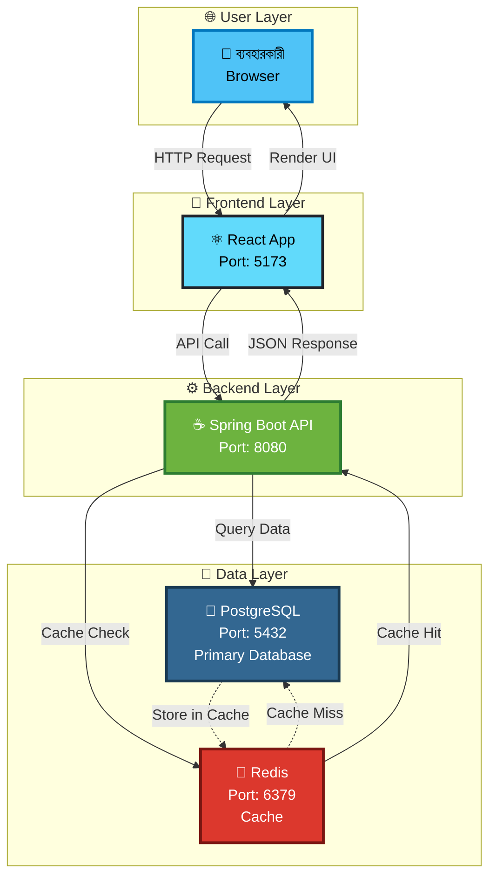
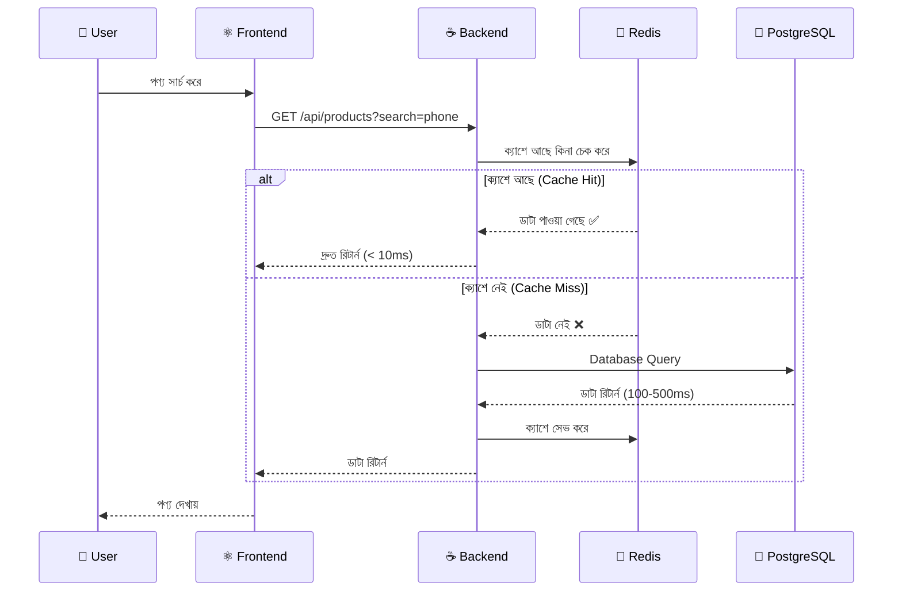
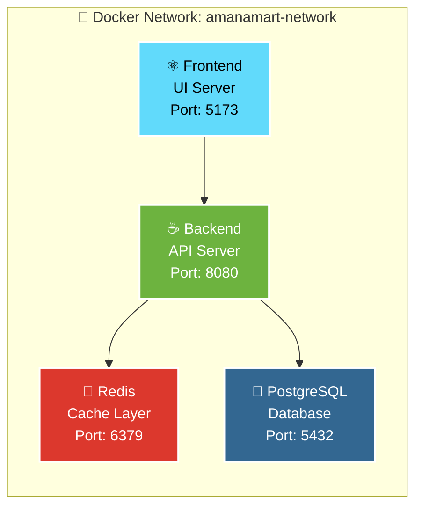
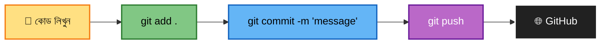
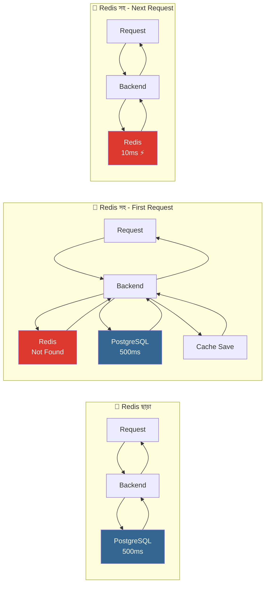
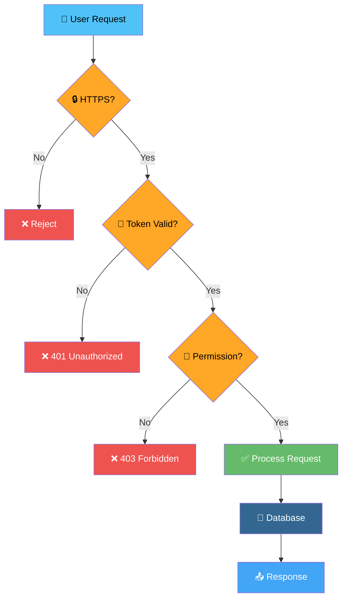
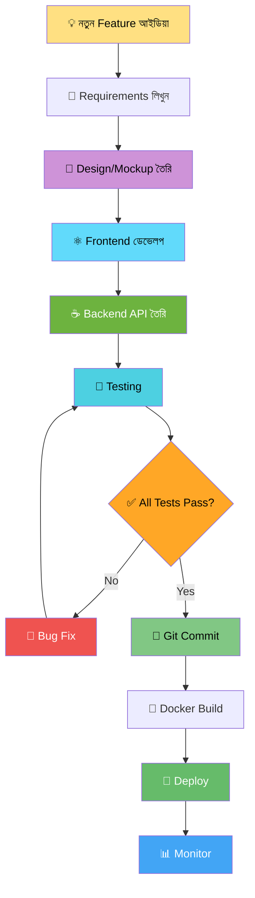
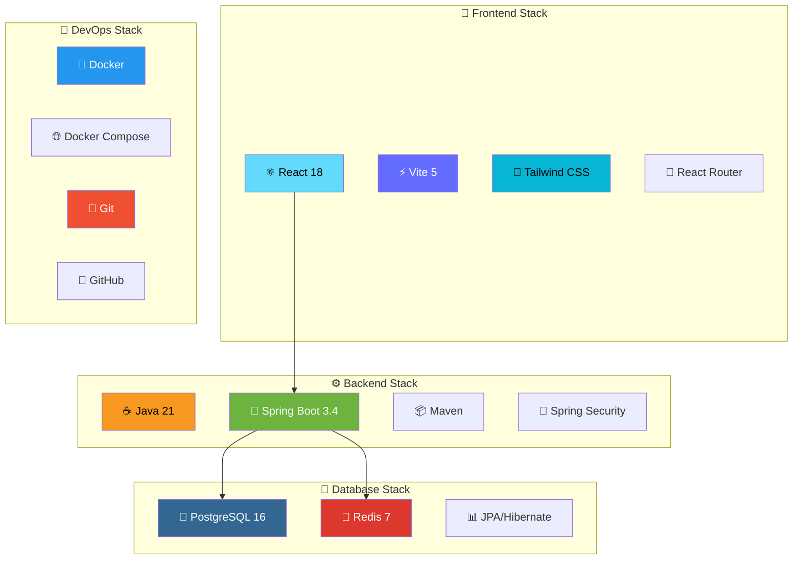
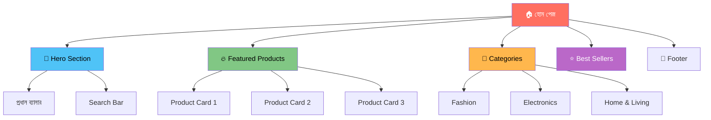
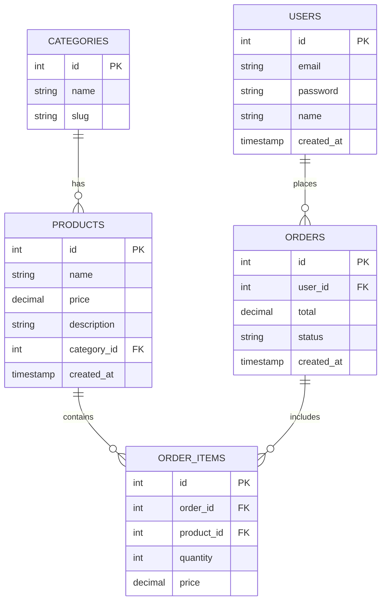

# 🎨 প্রজেক্ট ভিজুয়াল গাইড (Visual Guide)

> **এক নজরে পুরো প্রজেক্ট - ছবি এবং ডায়াগ্রাম সহ**

---

## 📊 সিস্টেম আর্কিটেকচার (System Architecture)



---

## 🔄 ডাটা ফ্লো (Data Flow)

### একজন ইউজার যখন পণ্য খোঁজে (Product Search)



---

## 🐳 Docker Services ওভারভিউ



### সার্ভিস বিবরণ:

| সার্ভিস | আইকন | পোর্ট | সাইজ | কাজ |
|---------|------|--------|------|-----|
| Redis | 🔴 | 6379 | ~5MB | সুপারফাস্ট ক্যাশিং |
| PostgreSQL | 🐘 | 5432 | ~80MB | মূল ডাটাবেস |
| Backend | ☕ | 8080 | ~150MB | বিজনেস লজিক |
| Frontend | ⚛️ | 5173 | ~50MB | ইউজার ইন্টারফেস |

---

## 📁 ফোল্ডার স্ট্রাকচার (Folder Structure)

```
🏪 devamanamart-ecommerce/
│
├── 📂 backend/                          # ☕ Java Backend
│   ├── 📂 src/
│   │   ├── 📂 main/
│   │   │   ├── 📂 java/com/amanamart/
│   │   │   │   ├── 📄 AmanamartApplication.java
│   │   │   │   ├── 📂 controller/      # API Endpoints
│   │   │   │   ├── 📂 service/         # Business Logic
│   │   │   │   ├── 📂 repository/      # Database Access
│   │   │   │   └── 📂 model/           # Data Models
│   │   │   └── 📂 resources/
│   │   │       └── 📄 application.properties
│   │   └── 📂 test/
│   ├── 📄 pom.xml                      # Maven Configuration
│   ├── 📄 Dockerfile
│   └── 📄 mvnw
│
├── 📂 frontend/                         # ⚛️ React Frontend
│   ├── 📂 src/
│   │   ├── 📂 components/
│   │   │   ├── 📄 Navbar.jsx
│   │   │   ├── 📄 ProductCard.jsx
│   │   │   ├── 📄 Footer.jsx
│   │   │   └── 📄 HeroSection.jsx
│   │   ├── 📂 pages/
│   │   │   ├── 📄 Home.jsx
│   │   │   ├── 📄 ProductList.jsx
│   │   │   └── 📄 ProductDetail.jsx
│   │   ├── 📂 services/
│   │   │   └── 📄 api.js              # Backend Connection
│   │   ├── 📂 assets/
│   │   ├── 📄 App.jsx
│   │   └── 📄 main.jsx
│   ├── 📂 public/
│   ├── 📄 package.json
│   ├── 📄 vite.config.js
│   └── 📄 Dockerfile
│
├── 📂 docs/                             # 📚 সব ডকুমেন্টেশন
│   ├── 📂 00_Git_Integration/
│   │   └── 📄 README.md                # Git টিউটোরিয়াল
│   ├── 📂 01_Setup/
│   │   └── 📄 README.md                # ইনস্টলেশন গাইড
│   ├── 📂 02_Backend_API/
│   │   └── 📄 README.md                # Backend ডক্স
│   ├── 📂 03_Frontend_React/
│   │   └── 📄 README.md                # Frontend ডক্স
│   ├── 📂 04_Dashboard/
│   │   └── 📄 README.md                # Dashboard ডক্স
│   ├── 📂 05_Troubleshooting/
│   │   └── 📄 README.md                # সমস্যা সমাধান
│   ├── 📂 06_Docker/
│   │   ├── 📄 01_Redis_Service.md
│   │   ├── 📄 02_PostgreSQL_Service.md
│   │   ├── 📄 03_Backend_Service.md
│   │   └── 📄 04_Frontend_Service.md
│   ├── 📂 07_Configuration_Secrets/
│   │   └── 📄 README.md                # পাসওয়ার্ড ভল্ট
│   └── 📄 README.md                    # মাস্টার ইনডেক্স
│
├── 🐳 docker-compose.yml                # Docker সেটআপ ফাইল
├── 📄 README.md                         # প্রজেক্ট ওভারভিউ
├── 📄 .gitignore                       # Git Ignore Rules
├── 📄 CHANGELOG.md                     # পরিবর্তনের ইতিহাস
└── 📄 auto_save.bat                    # Auto Backup Script
```

---

## 🔀 Git ওয়ার্কফ্লো (Git Workflow)



### ধাপে ধাপে:

```bash
# ১. কোড লিখুন বা পরিবর্তন করুন
# ... আপনার পরিবর্তন ...

# ২. Status চেক করুন
git status

# ৩. সব পরিবর্তন Add করুন
git add .

# ৪. Commit করুন (একটি ভালো message সহ)
git commit -m "Added payment gateway integration"

# ৫. GitHub এ Push করুন
git push origin main
```

---

## 🎯 API Endpoints ম্যাপ

```mermaid
graph TB
    A[🌐 http://localhost:8080]
    
    A --> B[/api/products]
    A --> C[/api/categories]
    A --> D[/api/users]
    A --> E[/api/orders]
    
    B --> B1[GET - সব পণ্য]
    B --> B2[GET /:id - একটি পণ্য]
    B --> B3[POST - নতুন পণ্য]
    B --> B4[PUT /:id - আপডেট]
    B --> B5[DELETE /:id - মুছে ফেলা]
    
    C --> C1[GET - সব ক্যাটাগরি]
    C --> C2[POST - নতুন ক্যাটাগরি]
    
    D --> D1[POST /register - নিবন্ধন]
    D --> D2[POST /login - লগইন]
    D --> D3[GET /profile - প্রোফাইল]
    
    E --> E1[GET - সব অর্ডার]
    E --> E2[POST - নতুন অর্ডার]
    E --> E3[GET /:id - অর্ডার বিস্তারিত]
    
    style A fill:#6DB33F,stroke:#fff,stroke-width:3px,color:#fff
    style B fill:#42A5F5,stroke:#fff,stroke-width:2px,color:#fff
    style C fill:#66BB6A,stroke:#fff,stroke-width:2px,color:#fff
    style D fill:#FFA726,stroke:#fff,stroke-width:2px,color:#000
    style E fill:#AB47BC,stroke:#fff,stroke-width:2px,color:#fff
```

---

## 📊 পারফরমেন্স মেট্রিক্স

### ⚡ স্পীড তুলনা (With vs Without Redis)



### 📈 পারফরমেন্স তুলনা:

| Scenario | Response Time | Improvement |
|----------|---------------|-------------|
| Without Cache | 500ms | - |
| First Request (Cache Miss) | 520ms | -4% (slightly slower) |
| Cached Request (Cache Hit) | 10ms | **98% faster!** ⚡ |

---

## 🔐 সিকিউরিটি লেয়ার্স



---

## 🛠️ ডেভেলপমেন্ট ওয়ার্কফ্লো



---

## 📦 টেকনোলজি স্ট্যাক ভিজুয়ালাইজেশন



---

## 🎯 শেখার পথ (Learning Path)

```mermaid
journey
    title আপনার শেখার যাত্রা
    section সপ্তাহ ১: শুরু
      Git ইনস্টল: 5: ইউজার
      প্রজেক্ট সেটআপ: 4: ইউজার
      Docker বেসিক: 3: ইউজার
    section সপ্তাহ ২: বোঝা
      Frontend দেখা: 4: ইউজার
      Backend API: 3: ইউজার
      Database: 2: ইউজার
    section সপ্তাহ ৩: করা
      কোড পরিবর্তন: 5: ইউজার
      নতুন Feature: 4: ইউজার
      Testing: 5: ইউজার
    section সপ্তাহ ৪: মাস্টার
      Production Deploy: 5: ইউজার
      পুরো বোঝা: 5: ইউজার
```

---

## 🎨 ইউজার ইন্টারফেস প্রিভিউ

### 🏠 হোম পেজ ফ্লো



---

## 📊 ডাটাবেস স্কিমা (Simplified)



---

## 🎉 সম্পূর্ণ!

এই ভিজুয়াল গাইডটি আপনাকে পুরো প্রজেক্ট একনজরে বুঝতে সাহায্য করবে। প্রতিটি ডায়াগ্রাম একটি নির্দিষ্ট অংশ ব্যাখ্যা করে।

### 🔗 পরবর্তী ধাপ:
- [📚 মাস্টার ইনডেক্স দেখুন](README.md)
- [🌿 Git টিউটোরিয়াল শুরু করুন](00_Git_Integration/README.md)
- [🚀 প্রজেক্ট রান করুন](01_Setup/README.md)

---

*তৈরি করেছেন Antigravity Team ❤️*
